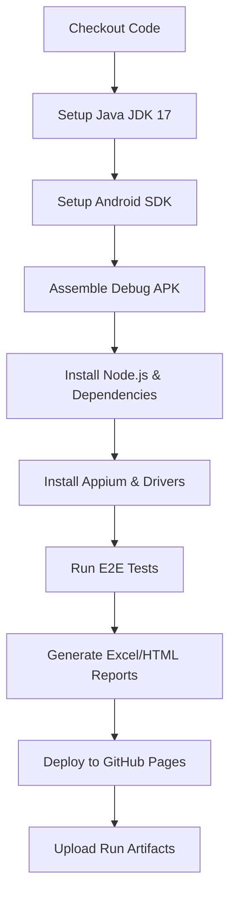

# Enterprise CI/CD Pipeline Execution Guide

This guide describes the structure, flow, and configuration of the GitHub Actions workflow for automated Android Appium testing and reporting.

---

## 1. Pipeline Execution Flow

The workflow is configured in `.github/workflows/android-e2e.yml` and executes the following stages sequentially on a macOS runner (enabling hardware acceleration for the Android Emulator):

---

## 2. GitHub Actions Workflow Configuration

The workflow is triggered by:
- **Push** to `main` or `master` branches.
- **Pull Request** targeting `main` or `master`.
- **Manual dispatch** (`workflow_dispatch`).
- **Schedule**: Weekly runs on Mondays.

### Key Jobs and Steps
1. **Runner Platform**: Runs on `macos-13` to utilize HAXM hardware-accelerated emulator support.
2. **Build Stage**: `./gradlew assembleDebug` generates the Android application binary.
3. **Execution Fallback**: If an active physical or virtual emulator is not found in the runner, the runner automatically switches to **Simulated Validation Mode** to verify reporting generation logic successfully.
4. **GitHub Pages Deploy**: Automatically publishes output HTML files to the repository's `gh-pages` branch, serving latest reports under `/reports/latest/` and archived reports under `/reports/history/build-N/`.
5. **Artifact Retention**: Reports, spreadsheets, logs, and screenshots are packaged and uploaded as a workflow artifact, retained for 30 days.
